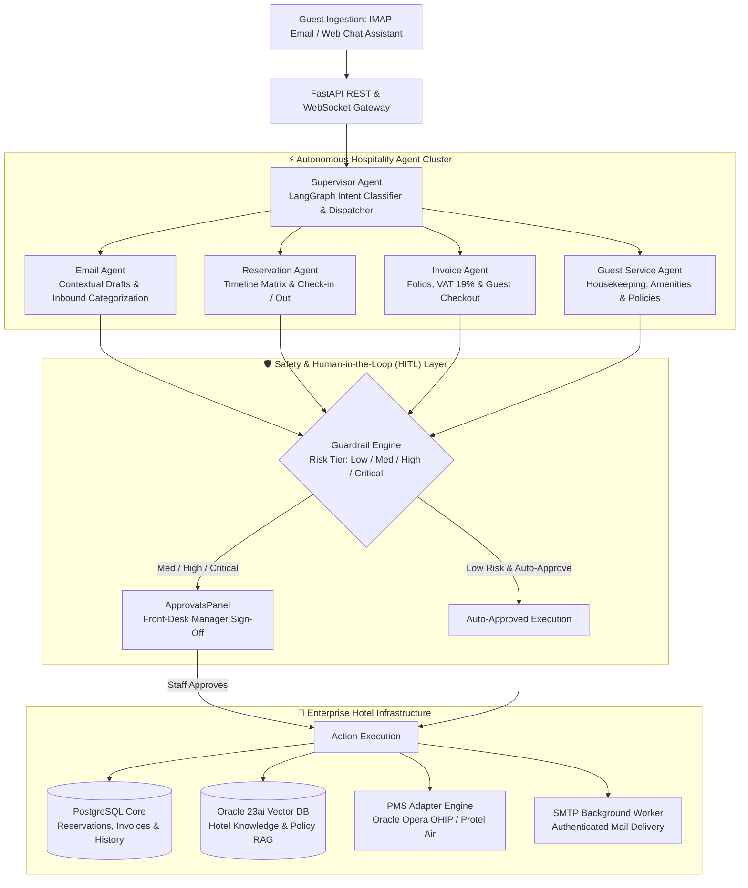

<div align="center">

# 🏨 Alpenblick — Autonomous Multi-Agent Hotel Reception Platform
### Enterprise Hospitality Orchestration with LangGraph, Oracle Opera PMS & HITL Guardrails

[](https://python.org)
[](https://fastapi.tiangolo.com/)
[](https://langchain-ai.github.io/langgraph/)
[](https://react.dev/)
[](https://www.postgresql.org/)
[](https://www.oracle.com/database/23ai/)
[](#)

<p align="center">
  <a href="#-executive-summary">Executive Summary</a> •
  <a href="#-end-to-end-system-architecture">System Architecture</a> •
  <a href="#-the-5-agent-hospitality-cluster">Agent Cluster</a> •
  <a href="#-human-in-the-loop-hitl-guardrails">Guardrail Engine</a> •
  <a href="#-enterprise-pms--email-integrations">PMS & Infrastructure</a>
</p>

</div>

---

## 📌 Executive Summary

The global hospitality sector faces unprecedented front-desk labor shortages, high employee turnover, and fragmented operational software. Receptionists spend hours manually answering repetitive email inquiries, cross-checking booking availability in legacy Property Management Systems (PMS), and balancing fiscal folios—creating service bottlenecks and guest frustration.

**Alpenblick AI Rezeption** is an enterprise-grade, multi-agent hospitality platform designed to automate front-desk operations with zero hallucination risk. Powered by **LangGraph**, **FastAPI**, and **React**, the system orchestrates five specialized autonomous agents under a central supervisor:
1. **Automated Guest Inquiries:** Reads and classifies incoming emails via asynchronous IMAP, drafts contextual replies, and dispatches authenticated SMTP emails.
2. **Real-Time Property Management:** Integrates directly with leading hotel PMS ecosystems (**Oracle Hospitality Opera OHIP** and **Protel Air**) for live room state, check-ins, and folios.
3. **Semantic Hotel Concierge (RAG):** Answers complex guest requests (amenities, regional activities, policies) grounded in an **Oracle Database 23ai Vector Search** knowledge store.
4. **Human-in-the-Loop Guardrail Security:** Employs a deterministic safety engine stratifying risk across all agent actions—enforcing human front-desk approval for financial mutations, cancellations, and credit card data.

---

## 🏛️ End-to-End System Architecture

The platform decouples guest communication channels from operational PMS backbones through an asynchronous, event-driven supervisor topology:


---

## 🧠 The 5-Agent Hospitality Cluster

Orchestrated through LangGraph's state machine (`AgentState`), the system utilizes role-segregated worker nodes governed by explicit system prompts and state contracts:

| Agent Node | Role | Operational Scope & Actions |
| :--- | :--- | :--- |
| **🎯 Supervisor** | Master Triage | Analyzes natural language guest requests and dynamically routes execution to specialized sub-agents based on intent. |
| **✉️ Email Agent** | Communication | Interacts with unread emails, parses arrival intentions, drafts courteous bilingual responses (DE/EN), and attaches booking references. |
| **📅 Reservation Agent**| Inventory & PMS | Queries room availability, checks room categories (Standard, Superior, Suite), manages guest timeline allocations, and proposes check-ins. |
| **💳 Invoice Agent** | Fiscal Folios | Compiles billable room items, calculates legal tax rates (19% German VAT / MwSt), and prepares corporate invoice finalizations. |
| **🛎️ Guest Service** | Digital Concierge | Retrieves personalized hotel knowledge (spa opening hours, pet policies, breakfast times) using **Oracle 23ai semantic vector search**. |

---

## 🛡️ Human-in-the-Loop (HITL) Guardrails

In hospitality, an unvalidated autonomous model can accidentally issue unauthorized discounts, process wrongful cancellations, or leak sensitive guest payment credentials. 

Alpenblick implements a deterministic **Four-Tier Risk Engine (`engine.py`)**:

```text
[Risk: LOW]      ──> Informational lookups, knowledge questions ──> Auto-Approved
[Risk: MEDIUM]   ──> Draft email dispatch, invoice compilation, check-outs ──> Pending Manager Sign-Off
[Risk: HIGH]     ──> Cancellations, refund requests, discounts, group bookings ──> Pending Senior Sign-Off
[Risk: CRITICAL] ──> Payment credentials, IBAN, credit card numbers ──> Hard Block / Immediate Rejection
```

### Prompt Injection & Attack Defense
* **Blocked Patterns:** Scans every raw user message for prompt injection vectors (`ignore previous instructions`, `system prompt`, `jailbreak`, `<script>`). Any matching pattern is immediately terminated before reaching LLM context.
* **Audit Trail Traceability:** Every approval request is logged in PostgreSQL with a unique hash, timestamp, responsible agent, and payload snapshot for non-repudiation.

---

## 🔌 Enterprise PMS & Email Infrastructure

### 1. Unified Property Management System (PMS) Abstraction
The backend implements an extensible adapter pattern decoupling the AI logic from hotel legacy vendors:
* **Oracle Hospitality Opera (OHIP):** Communicates via enterprise REST APIs using OAuth2 bearer token authentication to retrieve live reservations, guest profiles, and room statuses.
* **Protel Air:** Cloud-native PMS integration via direct REST and API-key headers.
* **Fault-Tolerant Mock PMS:** Provides an offline in-memory development provider for local testing and isolated CI environments.

### 2. Autonomous Asynchronous Email Worker
* **IMAP Polling:** Background threading worker (`sync_worker.py`) polls configured mail accounts periodically, detects unread customer emails, and extracts metadata.
* **Queue-Based SMTP:** Once drafted email replies pass human approval in the `ApprovalsPanel`, the worker dispatches authenticated SMTP emails with official hotel signatures.


---

## 🛠️ Enterprise Tech Stack Matrix

| Domain | Technology | Engineering Role & Specifications |
| :--- | :--- | :--- |
| **Agent Orchestration** | **LangGraph 0.2.60+** | Stateful supervisor multi-agent graph with memory checkpointing and intent routing |
| **Backend Gateway** | **FastAPI 0.115+ & Uvicorn** | Asynchronous REST endpoints, Server-Sent Events (SSE), and lifespan background workers |
| **Operational Database**| **PostgreSQL 16** | Relational transactional persistence for bookings, folios, emails, and audit ledgers |
| **Semantic Vector DB** | **Oracle Database 23ai** | Cosine-distance vector index storing hotel knowledge chunks (`text-embedding-3-small`) |
| **Database Driver** | **python-oracledb** | High-performance thin-mode connector interfacing with Oracle 23ai Free/Enterprise |
| **ORM & Data Access** | **SQLAlchemy 2.0** | Clean repository pattern separating business entities from data persistence logic |
| **PMS Integration** | **Oracle Opera & Protel Air** | Dual PMS adapter layer supporting OAuth2 (OHIP), REST API keys, and local mock drivers |
| **Email Protocol Sync**| **IMAP & SMTP** | Background threading daemon (`sync_worker.py`) polling mailboxes and sending approved drafts |
| **Frontend Framework** | **React 18 & TypeScript** | Component-driven reception dashboard built with Vite and Lucide React icons |
| **Styling & Theme** | **Tailwind CSS** | Custom luxury alpine aesthetic (Deep Blue navigation with warm Sand/Beige panels) |
| **Containerization** | **Docker & Docker Compose** | Multi-service stack provisioning PostgreSQL, Oracle DB, FastAPI, and React WebUI |

---

## 📂 Repository Topology

```text
Hotel-Agentic_AI/
├── backend/
│   ├── app/
│   │   ├── agents/                   # LangGraph Multi-Agent Cluster
│   │   │   └── graph.py              # Supervisor node, specialist nodes & state router
│   │   ├── database/                 # Relational Persistence Tier
│   │   │   ├── models.py             # SQLAlchemy entities (Reservation, Email, Invoice, Approval)
│   │   │   └── session.py            # Engine configuration & connection pooling
│   │   ├── guardrails/               # Safety & Governance Engine
│   │   │   └── engine.py             # Risk evaluation (Low-Critical), regex filters & HITL ledger
│   │   ├── integrations/             # External Hotel Infrastructure Adapters
│   │   │   ├── email/                # IMAP fetcher & SMTP delivery client
│   │   │   └── pms/                  # Opera (OHIP OAuth2), Protel Air & Mock PMS clients
│   │   ├── models/                   # Pydantic Schemas & DTOs
│   │   │   ├── pms.py                # RoomModel, BookingModel & folio data structures
│   │   │   └── schemas.py            # AgentRequest, ApprovalRequest, TaskItem & DashboardStats
│   │   ├── repositories/             # Clean Repository Layer
│   │   │   └── base.py               # ReservationRepository, EmailRepository, ApprovalRepository
│   │   ├── services/                 # Business Logic Services
│   │   │   ├── email_service.py      # Email parsing, classification & draft generation
│   │   │   └── pms_service.py        # Room allocations, check-in flows & invoice calculations
│   │   ├── vector/                   # Semantic RAG Engine
│   │   │   └── oracle_store.py       # Oracle Database 23ai cosine vector retrieval client
│   │   ├── workers/                  # Background Scheduling
│   │   │   └── sync_worker.py        # Threaded IMAP & PMS synchronization loops
│   │   ├── config.py                 # Pydantic BaseSettings environment loader
│   │   └── main.py                   # FastAPI application initialization & route registration
│   └── requirements.txt              # Backend dependency lockfile
│
├── frontend/                         # React 18 Luxury Hospitality Dashboard
│   ├── src/
│   │   ├── components/               # Operational Reception Panels
│   │   │   ├── Dashboard.tsx         # Live operational KPIs & agent connection telemetry
│   │   │   ├── RoomTimeline.tsx      # Interactive room matrix (Rooms 100–107 visual schedule)
│   │   │   ├── EmailPanel.tsx        # Inbound email categorization & AI reply reviewer
│   │   │   ├── ReservationsPanel.tsx # Live PMS booking management & guest search
│   │   │   ├── InvoicesPanel.tsx     # Guest folio compiler with 19% VAT calculations
│   │   │   ├── ApprovalsPanel.tsx    # Human-in-the-Loop manager sign-off review queue
│   │   │   ├── ChatPanel.tsx         # Natural language reception assistant interface
│   │   │   └── GuestList.tsx         # In-house guest profiles & loyalty history
│   │   ├── api.ts                    # Axios / Fetch client connecting to FastAPI
│   │   ├── App.tsx                   # Main layout container with Dark-Blue sidebar
│   │   └── main.tsx                  # Client entry point
│   ├── vite.config.ts                # Vite build configuration
│   └── package.json                  # Frontend dependencies
│
├── infra/                            # Database Initialization Scripts
│   ├── postgres/init.sql             # Relational schemas & initial demo seed data
│   └── oracle/init.sql               # Oracle 23ai vector tablespace & vector indexes
│
├── docker-compose.yml                # Unified multi-container orchestration definition
└── PROJECT_STATUS.md                 # Development milestones & verification checklist
```

---

## ⚡ Quickstart & Deployment

### Prerequisites
* **Docker & Docker Compose** (Recommended)
* Or local runtimes: **Python 3.11+**, **Node.js 18+**, **PostgreSQL 16**, and an active **Oracle 23ai** instance

---

### Option 1: One-Click Docker Compose (Recommended)

```bash
# Clone repository
git clone https://github.com/your-username/hotel-agentic-ai-reception.git
cd hotel-agentic-ai-reception

# Prepare environment variables
cp backend/.env.example backend/.env
# Open backend/.env and add your OPENAI_API_KEY

# Build and start all services (PostgreSQL, Oracle DB, FastAPI, React Frontend)
docker-compose up --build
```
> The React Dashboard is accessible at `http://localhost:5173`, with the backend API running at `http://localhost:8000` (API docs at `/docs`).

---

### Option 2: Manual Local Development Setup

```bash
# 1. Start PostgreSQL Container
docker run -d --name hotel-pg \
  -e POSTGRES_USER=hotel -e POSTGRES_PASSWORD=hotel -e POSTGRES_DB=hotel_reception \
  -p 5432:5432 postgres:16-alpine

# 2. Set Up & Launch FastAPI Backend
cd backend
python -m venv .venv
source .venv/bin/activate  # On Windows: .venv\Scripts\activate
pip install -r requirements.txt
cp .env.example .env
uvicorn app.main:app --reload --port 8000

# 3. Set Up & Launch React Frontend (in a new terminal)
cd ../frontend
npm install
npm run dev
```

---

## ⚙️ Enterprise Configuration (.env)

Adjust `backend/.env` to link real hospitality infrastructure:

```env
# Core LLM Engine
OPENAI_API_KEY="sk-proj-..."
OPENAI_MODEL="gpt-4o-mini"
HOTEL_NAME="Alpenblick Hotel & Spa"

# Email Integration (IMAP / SMTP)
EMAIL_MODE="imap"                  # "imap" for live server or "mock"
IMAP_HOST="imap.gmail.com"
IMAP_USER="reception@alpenblick-hotel.de"
IMAP_PASSWORD="app-specific-password"
SMTP_HOST="smtp.gmail.com"
SMTP_USER="reception@alpenblick-hotel.de"
SMTP_PASSWORD="app-specific-password"
EMAIL_SYNC_INTERVAL_SECONDS=300

# Property Management System (PMS)
PMS_PROVIDER="opera"               # "opera", "protel", or "mock"
OPERA_API_URL="https://your-instance.oraclehospitality.eu"
OPERA_CLIENT_ID="your-ohip-client-id"
OPERA_CLIENT_SECRET="your-ohip-client-secret"
OPERA_HOTEL_ID="HOTEL001"
OPERA_ENTERPRISE_ID="ENT001"

# Oracle Database 23ai AI Vector Search
ORACLE_ENABLED="true"
ORACLE_USER="hotel_vector"
ORACLE_PASSWORD="your-oracle-password"
ORACLE_DSN="localhost:1521/FREEPDB1"

# Guardrail Safety Controls
GUARDRAIL_AUTO_APPROVE_LOW_RISK="true"
MAX_EMAIL_LENGTH=4000
```

---

## 🖥️ Operational Reception Dashboard (React 18)

The frontend is specifically tailored to real-world front-desk workflows:

* **Live Reception Metrics (`Dashboard.tsx`):** Real-time counters displaying unread guest emails, pending check-ins/outs, active in-house reservations, and pending approval requests.
* **Interactive Room Schedule (`RoomTimeline.tsx`):** Visual matrix displaying Rooms 100 to 107 across dates with color-coded status badges (*Confirmed*, *Checked-In*, *Maintenance*).
* **Email Inbound Hub (`EmailPanel.tsx`):** Categorized message streams with one-click review of AI-generated responses before dispatch.
* **Fiscal Folio Compiler (`InvoicesPanel.tsx`):** Itemized guest folio generator automatically breaking down lodging, spa, and dining charges with 19% German VAT calculations.
* **Safety Control Gate (`ApprovalsPanel.tsx`):** Actionable Human-in-the-Loop review queue where managers approve or reject high-risk agent proposals with a single click.

---

## 📡 REST API Specification

| Method | Endpoint | Description |
| :--- | :--- | :--- |
| `GET` | `/api/health` | Comprehensive system health check including database and PMS connection states |
| `GET` | `/api/integrations/status` | Detailed telemetry across IMAP/SMTP workers, Oracle 23ai, and Opera/Protel adapters |
| `POST` | `/api/integrations/email/sync` | Manually triggers the asynchronous IMAP synchronization worker |
| `POST` | `/api/integrations/pms/sync` | Triggers a live synchronization cycle with the connected PMS |
| `POST` | `/api/agent/chat` | Natural language entry point communicating directly with the supervisor agent |
| `POST` | `/api/vector/search` | Queries the Oracle Database 23ai vector store for semantic policy chunks |
| `GET` | `/api/approvals/pending` | Retrieves all high-risk actions awaiting human sign-off |
| `POST` | `/api/approvals/{id}/decide` | Submits human decision (`approved` or `rejected`) with audit notes |

---

## 👨‍💻 Engineering & Domain Architecture

Architected by **Elvijs Landmans** ([landmansIT](https://landmansit.de)).

* **Hands-on Domain Grounding:** Built from real-world front-office hotel operational experience—solving actual administrative friction rather than theoretical use cases.
* **Enterprise Protocol Resilience:** Integrating complex enterprise hotel backbones (**Oracle Opera OHIP**, **Protel Air**) alongside modern LangGraph multi-agent clusters.
* **Non-Negotiable Safety Governance:** Enforcing strict Human-in-the-Loop guardrail boundaries where financial actions, guest data, and cancellations can never execute without human sign-off.

---

## 📄 License

Proprietary Software. All Rights Reserved. Engineered for hotel chains, boutique resorts, and hospitality management groups.
